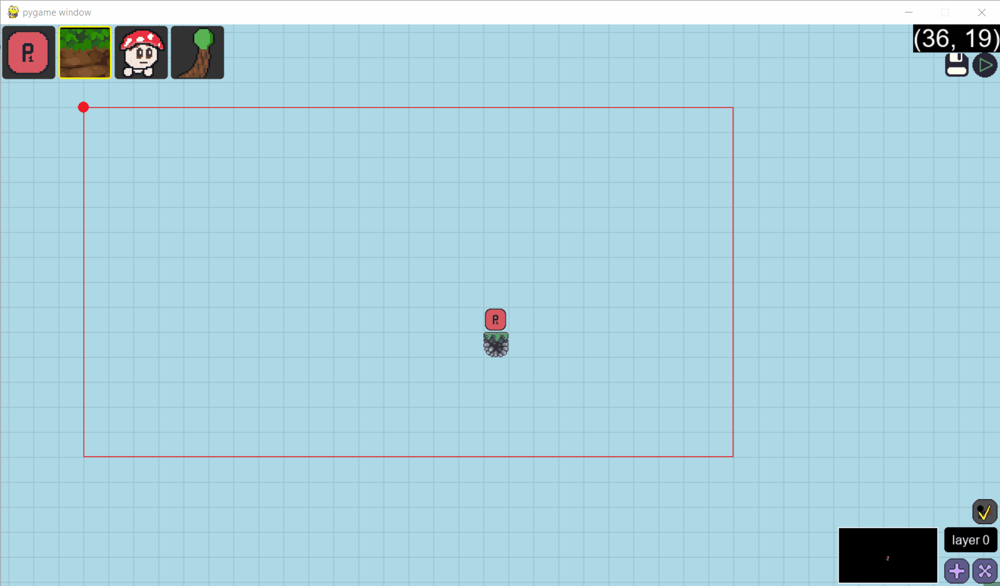

# 🎮 Platformer4 - Complete 2D Game Engine


A **full-featured 2D platformer game engine** built from scratch in Python using Pygame. This is not just a game - it's a complete game development framework with sophisticated systems and a professional-level visual editor.

## 🌟 **Most Impressive Features**

### 🛠️ **1. Visual Level Editor**

A complete level editor built from scratch with:

- **Real-time tile placement** with grid snapping and visual feedback
- **Multi-layer editing system** with layer switching and visibility controls
- **Dynamic element loading** with categorized hotbar interface
- **Border editing** for precise level boundary definition
- **Save/load system** with JSON-based level serialization
- **Grid visualization** with transparency and coordinate display
- **Mouse-based interaction** with proper coordinate conversion and drag support
  

```python
# Advanced editor capabilities
self.layer_index = 0  # Multi-layer support
self.world_elements_matrix = self.load_world_elements_matrix()  # Dynamic loading
self.border_click = False  # Border editing system
```

### 🏗️ **2. Architecture & Design Patterns**

Clean, modular architecture with:

- **Component-Based Design** with dedicated modules for each system
- **Entity-Component System** with inheritance hierarchy: `Entity` → `Player`, `Mob` → `Mushroom`, `Ba`
- **Factory Pattern** for dynamic entity creation using `get_mob_class()`
- **Separation of Concerns** with clean interfaces between systems
- **Object-Oriented Design** with proper abstraction and encapsulation

### 🎯 **3. Physics & Collision System**

Precise, responsive physics with:

- **Separate X/Y collision handling** for smooth, glitch-free movement
- **Gravity and velocity-based physics** with proper collision response
- **Special tile detection** (kill tiles, victory tiles) with event triggers
- **Collision state management** with multiple collision states
- **Spatial partitioning concepts** for efficient collision detection

```python
# Advanced collision system
self.collisions = {'top': False, 'bottom': False, 'right': False, 'left': False}
# Separate X/Y collision handling for smooth movement
```

### 🗺️ **4. Multi-Layer Tilemap Engine**

Complete tilemap system with:

- **Multi-layer tilemap** with collision detection and visibility controls
- **Automatic tile variance calculation** for seamless tile connections
- **Off-grid element support** for decorative objects and overlays
- **Border system** for level boundaries and camera constraints
- **JSON-based level serialization/deserialization**
- **Grid-based spatial indexing** for O(1) tile lookups

### 🤖 **5. Enemy AI System**

Intelligent enemy behavior with:

- **Pathfinding** for ground-based enemies with edge detection
- **Ranged attack AI** with mathematical trajectory calculation
- **Player targeting** with distance-based attack ranges
- **State-based behavior** (idle, patrol, attack, death)
- **Collision-aware movement** that prevents falling off platforms

```python
# Mathematical trajectory calculation for ranged attacks
strength = ((self.pos[0]- self.player.rect.centerx)**2 + (self.pos[1]- self.player.rect.centery)**2) ** 0.5
self.velocity = pygame.math.Vector2(speed * (self.player.rect.centerx- self.pos[0])/strength, speed * (self.player.rect.centery- self.pos[1])/strength)
```

## 🎨 **Visual & Animation Systems**

### 🎬 **6. Animation System**

Frame-based animation with:

- **Configurable animation speeds** per entity and state
- **State machine** for entity animations (idle, run, jump, fall, hit, death)
- **Sprite flipping** for directional movement
- **Animation index management** with proper timing and transitions
- **Draw offset system** for precise sprite positioning

### 🎥 **7. Camera & Rendering System**

Smooth rendering with multiple layers:

- **Smooth camera following** with scroll calculations and easing
- **Multi-layer rendering** with proper depth ordering
- **Background parallax system** with tiled backgrounds
- **Render scaling** for performance optimization
- **Surface caching** for efficient tile rendering

### 🎨 **8. Particle System & Visual Effects**

**Dynamic visual effects** that enhance gameplay:

- **Multiple particle types**: Death particles, projectile impact particles
- **Physics-based particle movement** with velocity and gravity
- **Visual effects** with blending and glow effects
- **Particle lifecycle management** with automatic cleanup
- **Mathematical particle distribution** for explosion effects

```python
# Particle explosion with mathematical distribution
for i in range(36):
    angle = i * (2 * math.pi / 36)
    speed = 1.5
    self.level.particle_list.append(Ba_Particle(self.game, self.level, self.pos,
        pygame.math.Vector2(random.random() * speed * math.cos(angle),
                           random.random() * speed * math.sin(angle))))
```

## 🎮 **Gameplay Systems**

### 🎯 **9. Projectile System**

Projectile mechanics with realistic physics:

- **Mathematical trajectory calculation** using trigonometry
- **Collision detection** with environment and entities
- **Impact effects** with particle explosions
- **Player-relative targeting** for enemy projectiles
- **Velocity-based movement** with proper physics

### 🎪 **10. Game State Management**

Complete game flow with multiple states:

- **Death/restart system** with fade transitions and animations
- **Victory/defeat conditions** with proper state handling
- **Level progression** system with seamless transitions
- **Health management** with visual feedback and UI
- **Pause and menu systems** with proper state preservation

### 🎨 **11. UI System**

User interface with modern design:

- **Animated buttons** with hover and click effects
- **Smooth transitions** with scale animations and easing
- **Multi-page level selection** with pagination
- **Modal dialogs** for level creation and configuration
- **Health display** with animated heart icons
- **Semi-transparent overlays** with proper blending

## 📊 **Technical Excellence**

### ⚡ **12. Performance Optimizations**

Efficient code that handles complex scenes:

- **Surface caching** for tile rendering to reduce memory allocation
- **Efficient collision detection** with spatial partitioning concepts
- **Optimized rendering** with proper blitting techniques
- **Memory management** with proper surface cleanup and garbage collection
- **Frame rate optimization** with 60 FPS target and smooth performance

### 🏗️ **13. Data Structures & Algorithms**

Data management for complex game states:

- **Grid-based spatial indexing** for fast tile lookups (O(1) access)
- **Dictionary-based entity management** for efficient entity tracking
- **Efficient coordinate systems** with proper transformations
- **JSON serialization** for level persistence and data management
- **Dynamic asset loading** with automatic discovery and caching

### 🎯 **14. Asset Management System**

Asset pipeline with dynamic loading:

- **Automatic asset discovery** from file system with recursive loading
- **JSON-based configuration** for entity properties and animation speeds
- **Layered asset organization** (entities, tiles, decor, utils)
- **Draw offset management** for precise sprite positioning
- **Animation speed configuration** per entity and state

```python
# Dynamic asset loading system
self.entities_assets = {}
self.animations_speed_dict = {}
self.draw_offset_dict = {}
self.load_entities_assets()
```

## 🚀 **Technical Skills Demonstrated**

### **Core Programming:**

- **Object-Oriented Design** - Clean inheritance hierarchies and encapsulation
- **Game Development** - Complete game engine from scratch
- **Mathematics** - Physics, collision detection, trajectory calculations
- **Data Structures** - Efficient spatial indexing and entity management
- **File I/O** - Asset loading, level serialization, configuration management

### **Advanced Concepts:**

- **Component-Based Architecture** - Modular, reusable systems
- **State Management** - Complex game state handling
- **Performance Optimization** - Efficient rendering and collision systems
- **UI/UX Design** - Professional user interfaces and interactions
- **System Design** - Scalable, maintainable architecture

## 🛠️ **Getting Started**

```bash
# Run the game
python game.py
```

**Controls:**

- **Arrow Keys**: Move player
- **Space**: Jump
- **Escape**: Return to menu
- **R**: Restart level (when dead)

**Editor Controls:**

- **Left Click**: Place tiles
- **Right Click**: Remove tiles
- **Mouse Wheel**: Switch layers
- **B**: Edit level borders
- **Ctrl**: Multi-select

---

This project demonstrates strong software engineering skills and shows the ability to build complex, multi-system applications from the ground up. The level editor provides a complete development environment, while the architecture showcases solid programming concepts and design patterns.
